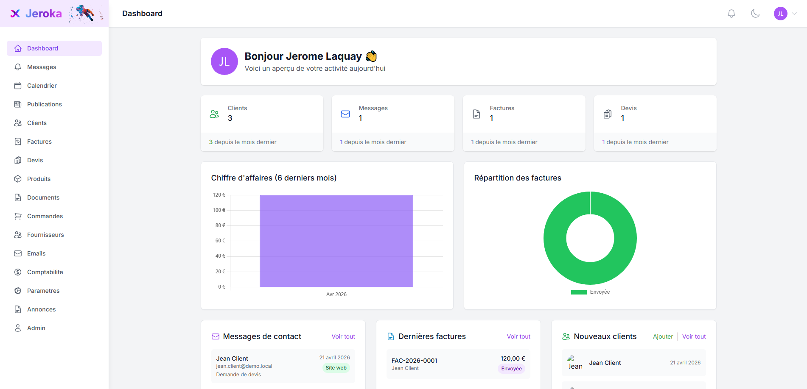

# Jeroka Back-Office

Back-office de gestion pour TPE/PME (frontend Vue + backend microservices Spring Boot).

## Vue d'ensemble

Le projet est un monorepo compose de :

- `backoffice/` : SPA Vue 3 (Vite, TypeScript, Pinia, Tailwind).
- `microservices/` : architecture microservices Java 21 (Spring Boot 3, Spring Security, Flyway, Kafka).
- `microservices/docker-compose.yml` : stack locale complete (Postgres, Kafka, gateway, services metier, workers, Adminer).

Le frontend appelle exclusivement la gateway (`http://localhost:3000/api/v1`).

### Apercu de l'interface



## Stack technique

- Frontend : Vue 3, TypeScript, Vite, Pinia, Tailwind CSS.
- Backend : Java 21, Spring Boot 3.4, Spring Cloud Gateway, Spring Security (JWT RS256 via JWKS).
- Data : PostgreSQL + Flyway (une base par domaine `jeroka_*`).
- Messaging : Kafka (events domaines, worker email, audit).
- Tooling : Docker Compose, Maven, Playwright MCP (tests E2E via Cursor).

## Structure du depot

```text
back-office/
├── backoffice/                 # Frontend
├── microservices/              # Gateway + services + workers + modules partages
│   ├── docker-compose.yml
│   ├── README.md
│   └── GOVERNANCE.md
└── .github/workflows/          # CI
```

## Services principaux (local)

- `gateway` (`3000`) : point d'entree API du front.
- `auth-service` (`3004`) : login/register/profile, JWT RS256, JWKS.
- `organization-service` (`3005`) : company, users, admin, settings (incluant OAuth Google cote org).
- `crm-service` (`3006`) : persons + messages.
- `catalog-service` (`3007`) : produits.
- `billing-service` (`3008`) : devis, factures, comptabilite.
- `scheduling-service` (`3009`) : rendez-vous.
- `content-service` (`3010`) : publications (+ stubs annonces/commandes).
- `docs-service` (`3011`) : endpoints documents/drive (stubs).
- `audit-service` (`3012`) : projection des events Kafka pour audit.
- `dashboard-bff` (`3013`) : aggregation des stats dashboard.
- `email-service` (`3003`) + `email-events-worker` : sync/categorisation emails et traitements asynchrones.

Ports detailes et conventions : `microservices/README.md`.

## Demarrage en local

### Prerequis

- Node.js 20+
- JDK 21+
- Maven 3.9+
- Docker Desktop

### 1) Configurer les variables d'environnement

- Fichier backend : `microservices/.env` (non versionne).
- Fichier frontend local : `backoffice/.env.development` avec :

```env
VITE_API_URL=http://localhost:3000/api/v1
```

Variables backend habituelles (selon tes integrations locales) :

- `DB_PASSWORD`
- `JWT_SECRET`, `JWT_REFRESH_SECRET`
- `INTERNAL_API_KEY`
- `GOOGLE_CLIENT_ID`, `GOOGLE_CLIENT_SECRET`, `GOOGLE_OAUTH_REDIRECT_URI`
- `OPENAI_API_KEY`, `ANTHROPIC_API_KEY`

### 2) Demarrer les microservices

Depuis la racine du repo :

```bash
docker compose -f microservices/docker-compose.yml down -v
docker compose -f microservices/docker-compose.yml up -d --build
```

Ce que fait la stack :

- `postgres-init` cree les bases `jeroka_*` au premier demarrage d'un volume vide.
- Chaque service applique ses migrations Flyway.
- Le service `sql-seed` attend les tables puis execute `microservices/sql/seed/10-seed-dev-data.sql` (idempotent).
- La gateway attend la fin du seed pour eviter un front sur des donnees non initialisees.

### 3) Demarrer le frontend

```bash
cd backoffice
npm install
npm run dev
```

- Front : `http://localhost:3001`
- API gateway : `http://localhost:3000/api/v1`
- Health gateway : `http://localhost:3000/actuator/health`

## Authentification de dev

Le seed de dev cree des comptes de test. Exemple utilise dans les tests locaux recents :

## Fonctionnalites couvertes

- Dashboard (stats agregees CRM + Billing).
- CRM : clients/personnes, messages, brouillons IA.
- Billing : devis, factures, comptabilite.
- Catalog : produits/categories/stats.
- Scheduling : rendez-vous.
- Content : publications.
- Email : synchronisation Gmail, categories, assignation d'expediteurs, pipeline async Kafka.
- Admin : entreprises/utilisateurs/statistiques (via `organization-service`) + audit Kafka.

## CI

Le monorepo utilise des workflows GitHub Actions (build/verification Maven par module).
Voir `.github/workflows/` et `microservices/GOVERNANCE.md`.

## Documentation complementaire

- `microservices/README.md` : cartographie des services, ports, Docker, seed.
- `microservices/GOVERNANCE.md` : conventions, securite, migration, gouvernance.
- `microservices/sql/README.md` : scripts SQL manuels (init/migration/seed) si besoin.
